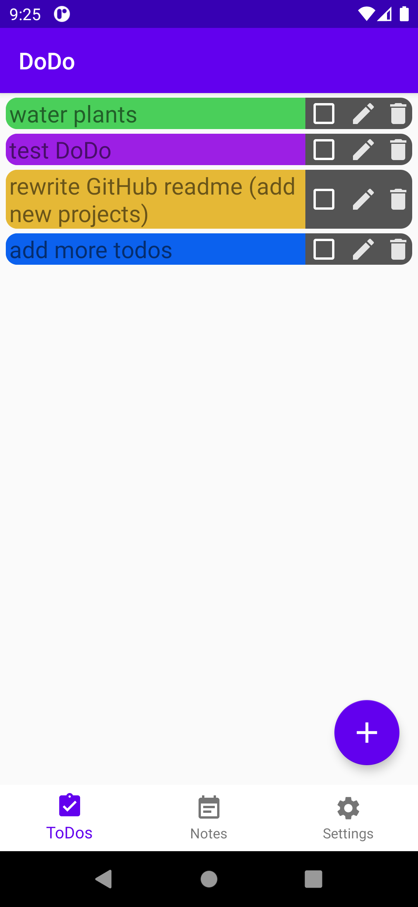

# DoDo
## What is this?
If you want to know why **DoDo** was created, you have to read following story: I was looking for a simple "ToDo"
application on Google's Play store, but I did not find any that behaved and looked like one I wanted to use. So I
decided to create one on my own. This repository represents that application, and I ended up with the idea naming it
"DoDo".
## What does it do?

 
### Tasks / ToDos
Saving simple todos and "tasks" how I called them in my code, is one feature of DoDo. Some simple text with a checkbox
to mark the item as done, an edit button, and a delete button. All of them will be displayed in a list. Each task's
background can be colored individually. The image on the right shows the current state of this feature. You can see
four different todos. Each of them has its own background color which can be set through a simple editing UI.

## Notes
Beside those simple todos, I also plan to implement typical notes. They can contain longer texts which can probably 
be formatted to add bold, underline, colored text and so on. As soon as I'm able to provide some footage of those notes
I will add one. 

## gRPC Sync
I also had the idea to create a server program (probably with Python, but I'll see) that can be set up on a local server.
It will store any text and can be synced with devices that are connected to the server. Everything will be based on
gRPC. You can find the whole program in another repo, just click [here](https://github.com/MapManagement/DoDo-Server).
Further details, and of course the source code as well, can be found there.

